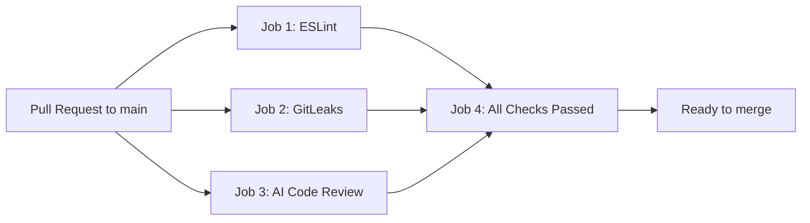

# ai-code-review-demo

An AI-powered code review bot that runs on every pull request to `main`. GitHub Actions lint your code, scan for hardcoded secrets, and send the PR diff to OpenAI for an automated review comment — all before anything can merge.

## What it does

This project demonstrates a lightweight CI/CD pipeline for pull requests:

1. **ESLint** — catches style and syntax issues in `src/`, `tests/`, and `review.js`
2. **GitLeaks** — scans changed PR files for hardcoded API keys, tokens, and other secrets
3. **AI Code Review** — sends changed-file diffs to OpenAI `gpt-4o` and posts the review as a PR comment
4. **All Checks Passed** — a final gate that requires all three jobs to succeed

The sample app in `src/api.js` is a simple in-memory todo API used as the target for demo PRs.

## Project structure

```
ai-code-review-demo/
├── .cursorrules              # Coding rules for AI assistants
├── .github/workflows/
│   └── pipeline.yml          # PR pipeline (lint, gitleaks, AI review, final check)
├── src/
│   └── api.js                # In-memory todo API
├── tests/
│   └── api.test.js           # Jest tests (happy path + error cases)
├── review.js                 # AI review script (GitHub + OpenAI)
├── DEMO.md                   # Step-by-step demo scenarios
└── README.md
```

## How the pipeline works



When a pull request is opened or updated against `main`:

1. **Lint** and **GitLeaks** run in parallel with **AI Code Review**.
2. `review.js` fetches changed files via the GitHub API, builds a diff, sends it to OpenAI, and posts the response as a PR comment.
3. **All Checks Passed** runs only after jobs 1–3 succeed. Configure branch protection to require this job before merging.

## Setup

### Prerequisites

- Node.js 20+
- A GitHub repository with Actions enabled
- An [OpenAI API key](https://platform.openai.com/api-keys)

### 1. Clone and install

```bash
git clone https://github.com/YOUR_USER/ai-code-review-demo.git
cd ai-code-review-demo
npm install
```

### 2. Add secrets to GitHub

In your repository, go to **Settings → Secrets and variables → Actions** and add:

| Secret | Description |
|--------|-------------|
| `OPENAI_API_KEY` | Your OpenAI API key for the AI review job |

`GITHUB_TOKEN` is provided automatically by GitHub Actions — no manual setup needed.

### 3. Enable branch protection (recommended)

Go to **Settings → Branches → Add rule** for `main`:

- Enable **Require status checks to pass before merging**
- Select **All Checks Passed** as a required check

This enforces that lint, GitLeaks, and AI review all pass before merge.

### 4. Run locally

```bash
# Run tests
npm test

# Run linter
npm run lint
```

To run the review script locally (requires env vars):

```bash
export GITHUB_TOKEN=your_token
export OPENAI_API_KEY=your_key
export GITHUB_REPOSITORY=owner/repo
export PR_NUMBER=1
npm run review
```

Never commit real credentials. Use environment variables or GitHub Secrets only.

## Demo scenarios

See [DEMO.md](./DEMO.md) for three walkthroughs:

| Scenario | What you do | What happens |
|----------|-------------|--------------|
| **A** | Paste a fake hardcoded API key into `src/api.js` | GitLeaks fails → fix with `process.env` → pipeline passes |
| **B** | Add a buggy function with no error handling | AI reviewer comments on the PR with issues found |
| **C** | Push a clean, well-written function with tests | All jobs pass; AI posts positive feedback |

## Coding rules

All contributors (human and AI) should follow [.cursorrules](./.cursorrules):

- Never hardcode API keys or secrets
- Always use `process.env` for credentials
- Keep code simple and well commented
- Add error handling for all API calls
- Write tests covering happy path and error cases

## License

MIT
